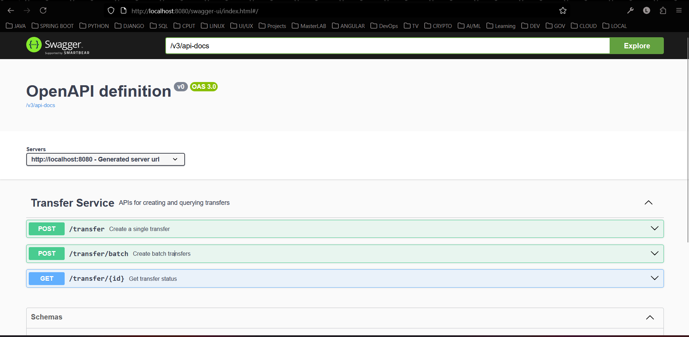

# Transfer Service

**Transfer Service** is a Spring Boot microservice for handling financial transfers between accounts. It communicates with a **Ledger Service** to perform atomic debit and credit operations and supports **idempotent single and batch transfers**.

---

## Features

- Create single transfer with idempotency support  
- Process batch transfers (up to 20 items)  
- Automatic retry/fallback using Resilience4j Circuit Breaker  
- Tracks transfer status (`SUCCESS` / `FAILURE`)  
- H2 in-memory database for development/testing  
- Correlation ID propagation for distributed tracing  

---

## Technologies

- Java 17  
- Spring Boot 3.2.x  
- Spring Web & WebFlux (for WebClient)  
- Spring Data JPA  
- H2 Database  
- Lombok  
- Resilience4j  
- SLF4J / Logback for logging  

---

## Requirements

- Java 17 or higher  
- Maven 3.8+  
- Running **Ledger Service** (default: `http://localhost:8081`)  

---

## Setup

1. **Clone the repository**
   ```bash
   git clone https://github.com/liyabonasaki/transfer-service.git
   cd transfer-service

## ⚙️ How to Run

### 🐳 Docker (Recommended)

1. **Ensure you have created the network to mount the 2 images**
   ```bash
   docker network create fintech-network

2. **Build the Docker image:**
   ```bash
   docker build -t transfer-service .

3. **Run the Docker image inside the network:**
   ```bash
   docker run -d --name transfer-service --network fintech-network -p 8080:8080 transfer-service

### 🧪 Running Locally (without Docker)

1. **Build the project to produce the jar :**
   ```bash
      mvn clean package
   
2. **Run the application:**
   ```bash
      java -jar target/transfer-service-0.0.1-SNAPSHOT.jar

### Running with Maven
1. **Clone the repository**
   ```bash
   git clone https://github.com/liyabonasaki/transfer-service.git
   cd transfer-service

2. **Build and run the project**
   ```bash
   mvn spring-boot:run

## Accessing the API using Swagger
Open your browser and go to http://localhost:8080/swagger-ui/index.html#/
